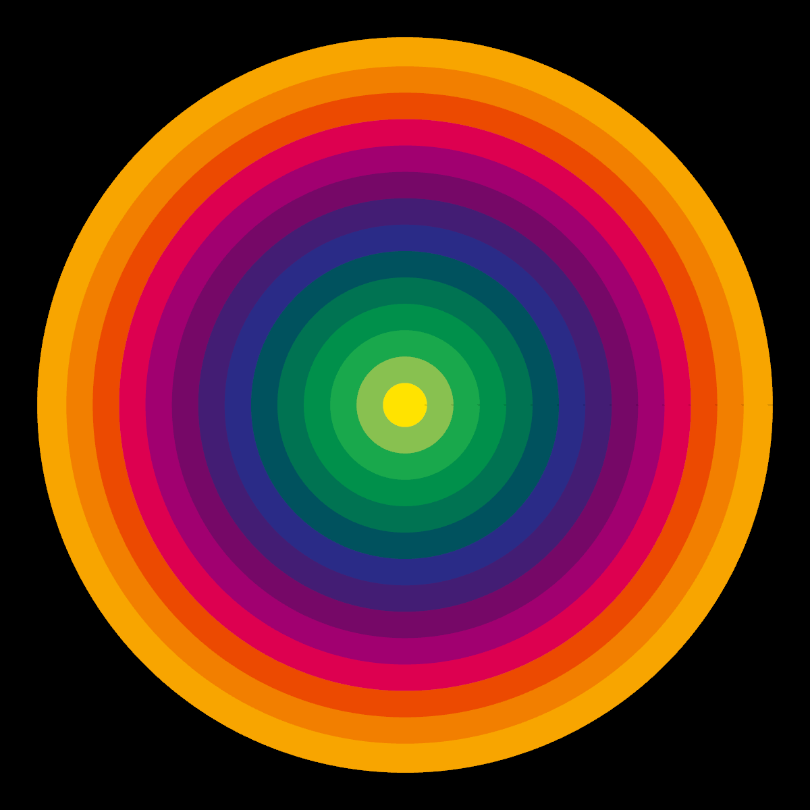
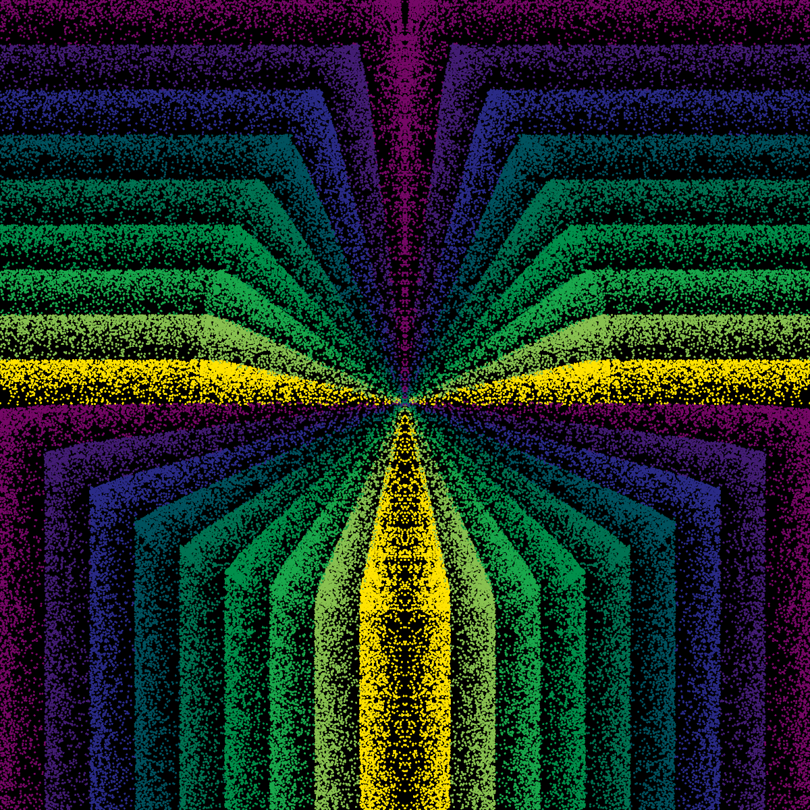
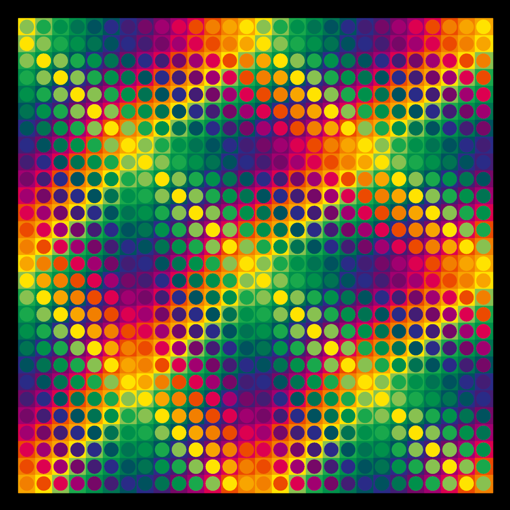
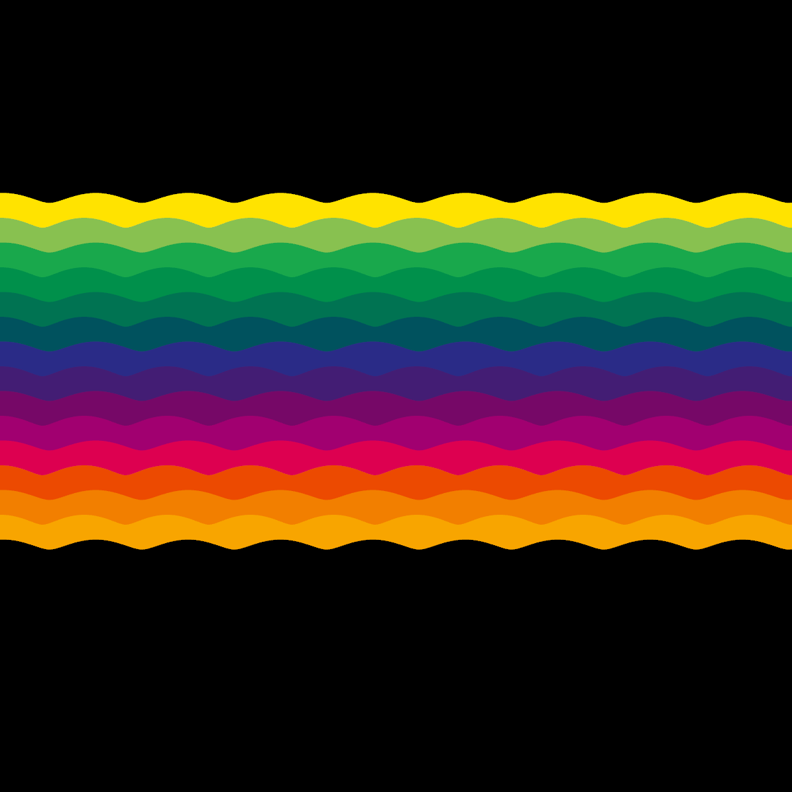

# Visuales

Hi! 👋

Welcome to my collection of scketches

They're build with [Rust](https://www.rust-lang.org/learn/get-started) 🦀 using [nannou](https://nannou.cc/).

## Examples

You need to have Rust installed in your sistem. After that, you can clone the repo and use `cargo` to run the examples.

Usage:

`cargo run --release -p <PACKAGE_NAME> --example <FILE_NAME>`

E.g:

`cargo run --release -p le_parc --example squares`  

or

`cargo run --release -p tame_impala --example circles`  

### [Julio Le Parc inspired](./le_parc/Readme.md)

|                                          |                                            |                                          |                                      |
| ---------------------------------------- | :----------------------------------------: | :--------------------------------------: | -----------------------------------: |
|  |  |  |  |
| [source](./le_parc/circles.rs)           | [source](./le_parc/parables.rs)            | [source](./le_parc/squares.rs)           | [source](./le_parc/waves.rs)         |

### [Tame Impala](./tame_impala/Readme.md)
